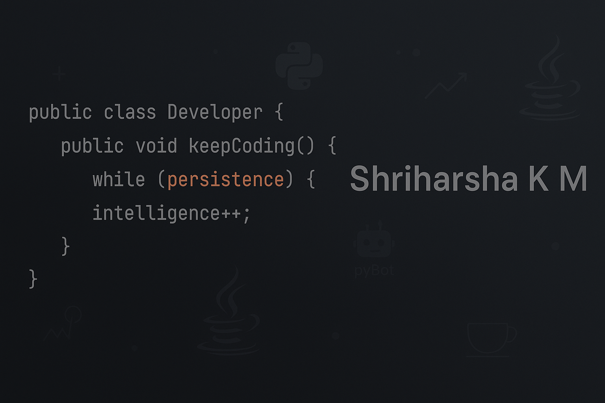

# 👋 Hey there, I'm Shriharsha K M!

🎓 Fresher | 💻 Java Enthusiast | 🧠 Lifelong Learner

I'm currently leveling up my Java skills at **X-workz**, diving deep into object-oriented programming, debugging nightmares (and victories!), and building real-world projects one class at a time.

---

## 🚀 What I'm Working On

- 🌱 Learning Java and exploring **backend development**
- 💬 Building cool Java projects (ask me about my recent debugging battle 👀)
- 🔧 Experimenting with **Python**, **HTML**, and **CSS**
- ✨ Making my chatbot project **PyBot** even smarter

---

## 🧠 Skills

- **Languages**: Java, Python, HTML, CSS  
- **Tools & Tech**: Git, GitHub, VS Code, Eclipse  
- **Soft Skills**: Time Management, Public Speaking, Team Player, Fast Learner

---

## 📫 Let's Connect!

- 📧 Email: [shriharshakm10@gmail.com](mailto:shriharshakm10@gmail.com)  
- 💼 LinkedIn: [Shriharsha K M](https://www.linkedin.com/in/shri-harsha-k-m-5758aa325/)  
- 🧑‍💻 GitHub: [ShriAlt](https://github.com/ShriAlt)

---

## 🔥 GitHub is My Daily Workout

I treat commits like reps and issues like puzzles. Keeping my streaks alive is not just a habit—it's a ritual!

---

## 🏆 GitHub Trophies

---

## 📊 GitHub Stats

---

## 🌟 Fun Fact

> I once spent more time fixing a single Java bug than I'd like to admit… but hey, **persistence is key**, and every bug teaches me something new!

---

Thanks for stopping by! Keep coding and stay awesome 🚀
